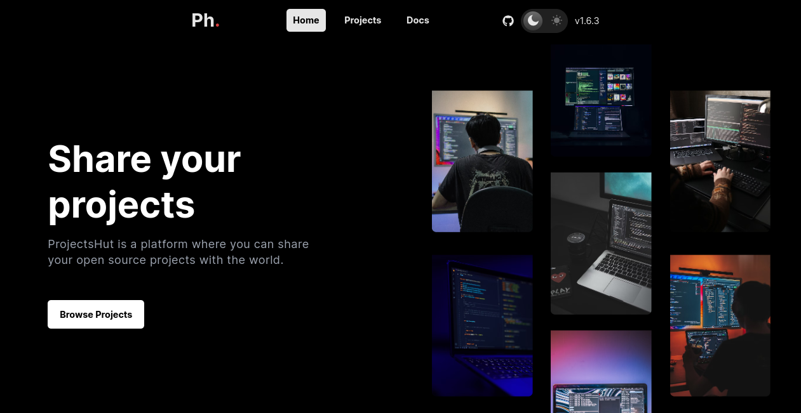
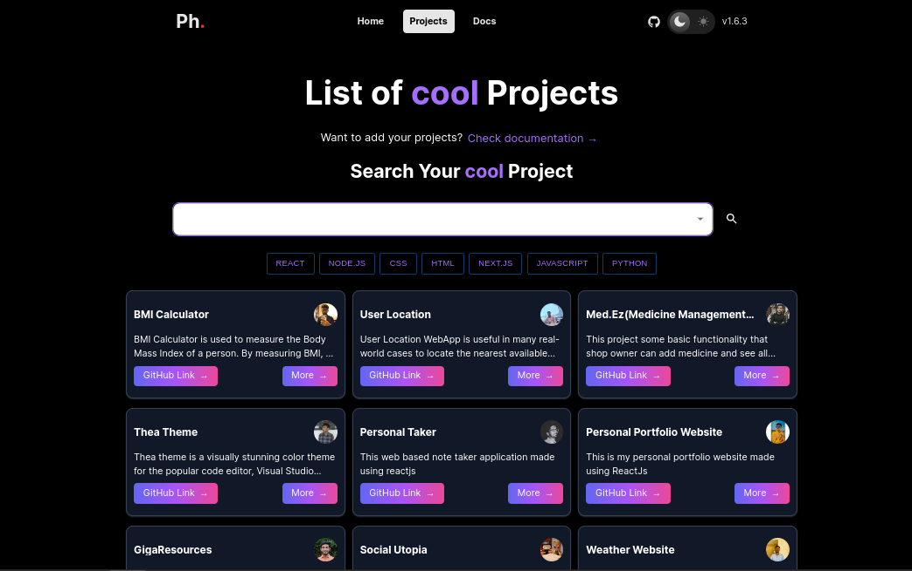

<h1 align=center> ProjectsHut </h1>

Welcome to the ProjectsHut GitHub repository! ProjectsHut is an open-source web application that empowers users to share and promote their projects with ease. Our platform provides a user-friendly interface for publishing projects and creating personalized user profiles. The primary goal of ProjectsHut is to cultivate a collaborative community of creative individuals, where ideas flourish and innovation thrives. Whether you're a developer, designer, or an enthusiastic project enthusiast, ProjectsHut offers the perfect platform to showcase your work and connect with like-minded individuals.  

-----

   
  
  
  
   
  
  
  
   
  
  

## ✨ Features

- **Open Source**: Projectshut itself is an open-source project, allowing developers to contribute, customize, and extend the platform according to their specific needs.

- **Collaboration Opportunities**: Connect with like-minded individuals, collaborate on projects, and exchange ideas

- **Project Publication**: Easily publish your projects on Projectshut, providing a platform for others to discover and explore your work.

- **Project Categorization**: Organize your projects into categories and tags for easy search and discovery. 

- **Notifications**: Stay up-to-date with notifications about project updates, comments, and new collaborations.

- **Multiple Language Access**: The website is available for multiple languages including 한국인, Española,தமிழ்,German,Italiano,Japanese,French,हिंदी and Tagalog.

## 💻 Tech Stack 

  &nbsp;
  &nbsp;
  &nbsp;
  &nbsp;
  &nbsp;

## ✨ How to use it? 

### To install and run Projectshut locally, follow these steps:

- Clone the repository: `git clone https://github.com/yourusername/projectshut.git`
- Navigate to the project `directory: cd projectshut`
- Install dependencies: `npm install`
- Set up the environment variables by creating a `.env` file based on the provided `.env.example` file.
- Start the application: `npm start`
- Access the application at `http://localhost:3000`

## ✨ Contributing Roadmap

Contributions are welcome! If you have any ideas, suggestions, or bug fixes, please open an issue or submit a pull request. Make sure to follow the project's code of conduct.

 - Go through the [CONTRIBUTING.md](https://github.com/poorvika11/ProjectsHut/blob/main/contributing.md) file, where all the guidelines have been mentioned that will guide you to make your contribution.
 - Do checkout the [project workflow](https://github.com/poorvika11/ProjectsHut/blob/main/CODE_OF_CONDUCT.md) section.

## ✨ Thank You for Your Contribution!

🙏 Thank you for your interest in contributing to our project! We appreciate any contributions, whether it's bug fixes, new features, or documentation improvements.

🌟 We value the time and effort you put into contributing, and we look forward to reviewing and merging your contributions. Join us on this exciting journey of creativity and collaboration, and let your projects shine on Projectshut!

## ✨Authors
[Priyankar Pal](https://github.com/priyankarpal) - Project Admin

[Hariket Sukeshkumar Sheth](https://github.com/hariketsheth) - Project Mentor

[Swapnil Garg](https://github.com/swapnilgarg7) - Project Mentor

## ✨ License

The project is licensed under the [MIT License](https://github.com/neelshah2409/Bot-Collection/blob/main/LICENSE).

---